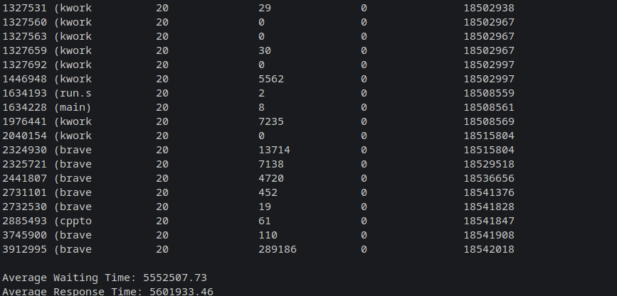
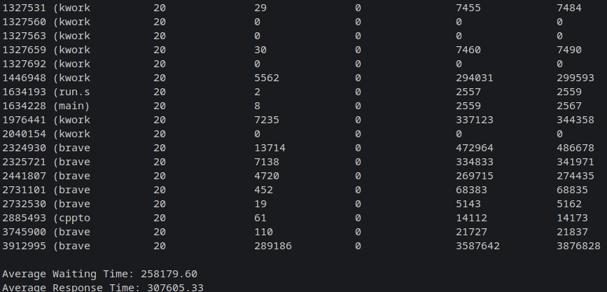
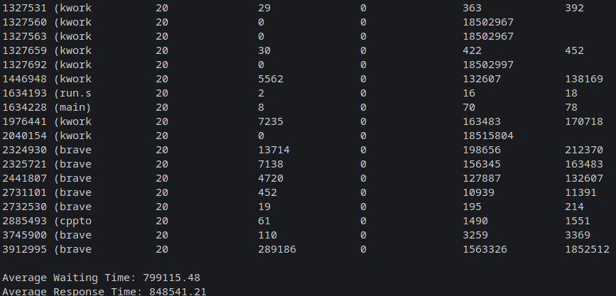

# Process Scheduling

To execute without Makefile:

```bash
gcc -o main main.c Components/process.h Components/reader.h Components/fcfs.h
./main
```

To execute with Makefile:

```bash
make
./bin/main
```

To execute with Bash:

```bash
./run.sh
```

## FCFS (First-Come, First-Served)

The FCFS algorithm is one of the simplest CPU scheduling methods. It works by assigning processes to the CPU in the order they arrive in the ready queue. In this method, the first arriving process is the first one to be serviced. However, it can lead to a phenomenon known as "priority inversion" and is not efficient in environments where long processes are waiting at the beginning.



## Round Robin

The Round Robin algorithm is a CPU scheduling approach that allocates a small time interval (quantum) to each process in the ready queue. The CPU is sequentially assigned to each process for a fixed time, and if the process doesn't complete during that interval, it is moved to the end of the queue. It's fair to all processes and ensures that no process gets blocked indefinitely, although it may incur high latency for long processes.



## SJF (Shortest Job First)

The SJF algorithm is a CPU scheduling strategy where the CPU is allocated to the process with the shortest estimated duration. This minimizes the average waiting time and maximizes efficiency. However, it requires accurate information about the duration of each process, which can be challenging to obtain in practice.


